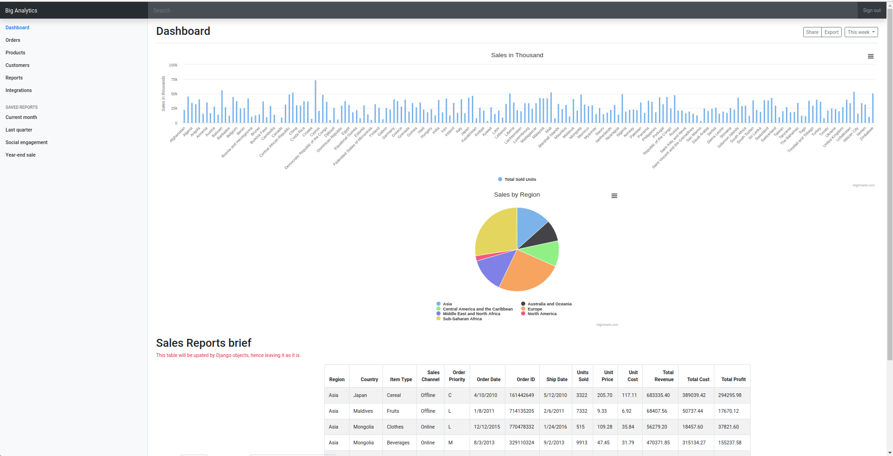

# Dashboard-using-Highcharts-and-Django
Setting up the project
The first thing to do is to install Django using the following command line: pip3 install django ,pip3 install pandas

Then I create the project using this command line: django-admin startproject sample_dashboard

The result of the project creation is a folder structure below, btw the structure is created by django-admin:

```
INSTALLED_APPS = [
    'django.contrib.admin',
    'django.contrib.auth',
    'django.contrib.contenttypes',
    'django.contrib.sessions',
    'django.contrib.messages',
    'django.contrib.staticfiles',
    'sales',
]
```

I also have to add the URL mapper by opening sample_dashboard/sample_dashboard/urls.py and adding URL mapper and the static folder.Url mapping it required to map the browser URL with the application. Here, I add included sales.url file defined in folder sales and I redirect blank URL (http://localhost:8000) to sales.

```
urlpatterns = [
    path('admin/', admin.site.urls),
    path('sales/', include("sales.urls")),
    path('', RedirectView.as_view(url='/sales/', permanent=True)),
] + static(settings.STATIC_URL, document_root=settings.STATIC_ROOT)
```

In this step, I define the view in the urls.py file. So in the previous step, I redirect the url (http://localhost:8000/sales) and in here I map <url>/sales/ to the view.

```
urlpatterns = [
    path('', views.index, name='index'),
]
```

In this step we will setup the templates so that we can view the templates into the django

```
TEMPLATES = [
    {
        'BACKEND': 'django.template.backends.django.DjangoTemplates',
        'DIRS': [os.path.join(BASE_DIR, 'templates')],
        .........
]
```

Before reading the data I have to define the view, and here how I do it.

```
categoriespie = list(rs_pie.index)
    valuespie = list(rs_pie.values)
    data = []
    for index in range(0, len(rs_pie.index)):
        # print(rs_pie.index[index])
        value = {'name': rs_pie.index[index], 'y': rs_pie.values[index]  }
        data.append(value)
```

For how the index rendered please check the `index.html`
```
    title: {
        text: 'Sales by Region'
    },
    tooltip: {
        pointFormat: '{series.name}: <b>{point.percentage:.1f}%</b>'
    },
    plotOptions: {
        pie: {
            allowPointSelect: true,
            cursor: 'pointer',
            dataLabels: {
                enabled: false
            },
            showInLegend: true
        }
    },
    series: [{
        name: 'Sales',
        colorByPoint: true,
        data: _values
```

Running the Application
Now, all I have to do is to run the application using this command line:python3 manage.py runserver

Then I open the application on the browser using the local host link http://localhost:8000/sales


